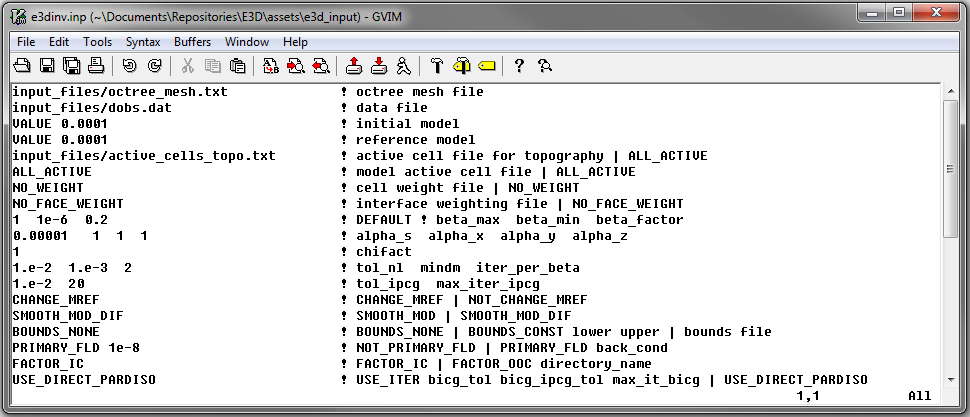

.. _example_inv:

Inversion
=========

Here, the code **e3d.exe** and the input file **e3dinv.inp** (:ref:`see format <e3d_input_inv>`) are used to invert secondary field Hz data. FEM data were created in the example ":ref:`forward modeling<example_fwd>`". Because this is a simple example, we assigned a floor uncertainty of 5e-10 A/m to all components being inverted. In practice, data are noisy and choosing appropriate uncertainties is very important for successful inversion. Files relevant to this part of the example are in the sub-folder *inv*. Before running this example, you may want to do the following:

	- `Download and open the zip folder containing the entire DCIP octree example <https://github.com/ubcgif/DCIPoctree/raw/master/assets/dcipoctree_example.zip>`__ (if not done already)
	- :ref:`Learn how to run code from command line <e3d_inv>`
	- :ref:`Learn the format of the input file <e3d_input_inv>`

DC Inversion
------------

To invert the synthetic data, the input file below was used:

The true model (left) and the final recovered model (right) are shown below. A cutoff of 0.001 S/m was used when plotting both models. The recovered model is sliced along the horizontal at an elevation of -200 m.

.. figure:: images/inv1.png
     :align: center
     :width: 700

IP Inversion
------------

dfasdfsa

