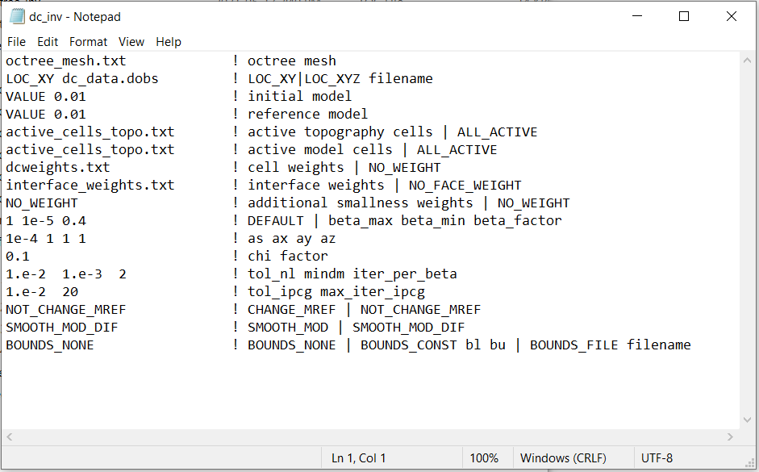
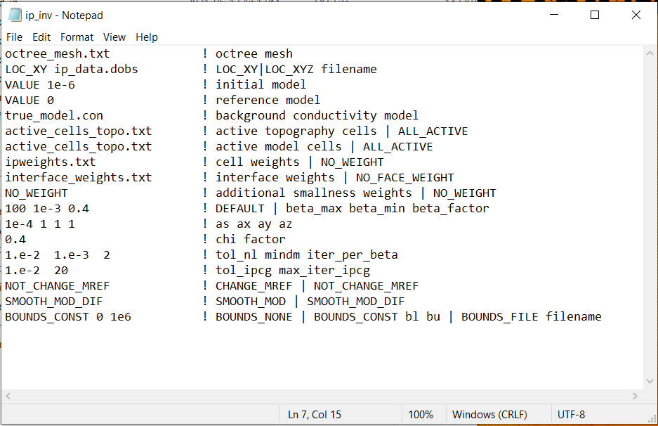

.. _example_inv:

Inversion
=========

Here, the codes **dcoctree_inv.exe** and **ipoctree_inv.exe** are used to recover conductivity and chargeability models, respectively. Because this is a simple example, we assigned a uncertainties of 1e-8 V + 1% to all DC data and uncertainties of 0.001 + 1% to all IP data. In practice, data are noisy and choosing appropriate uncertainties is very important for successful inversion. Before running this example, you may want to do the following:

	- `Download and open the zip folder containing the entire DCIP octree example <https://github.com/ubcgif/DCIPoctree/raw/master/assets/dcipoctree_example.zip>`__ (if not done already)
	- :ref:`Learn how to run code from command line <dc_inv>`
	- :ref:`Learn the format of the input file <dcip_input_dcinv>`

 the input file **dcipinv.inp** (:ref:`see format <dcip_input_dcinv>`) are used to invert secondary field Hz data. FEM data were created in the example ":ref:`forward modeling<example_fwd>`". 

DC Inversion
------------

.. note:: The anomalies to our test model are well-constrained by the data and sensitivity weights are not required. The effects of the sensitivities of near-surface cells will be minimized by applying a near-surface interface weighting. For this example, we merely recover the smoothest model.

Files relevant to this part of the example are in the sub-folder *dc_inv*. To invert the synthetic data, the input file below (**dc_inv.inp**) was used. For formatting, :ref:`see format <dcip_input_dcinv>` :

The true model (left) and the final recovered model (right) are shown below.

IP Inversion
------------

Files relevant to this part of the example are in the sub-folder *ip_inv*. To invert the synthetic data, the input file below (**ip_inv.inp**) was used. For formatting, :ref:`see format <dcip_input_ipinv>` :

The true model (left) and the final recovered model (right) are shown below. A cutoff of 0.001 S/m was used when plotting both models. The recovered model is sliced along the horizontal at an elevation of -300 m.

