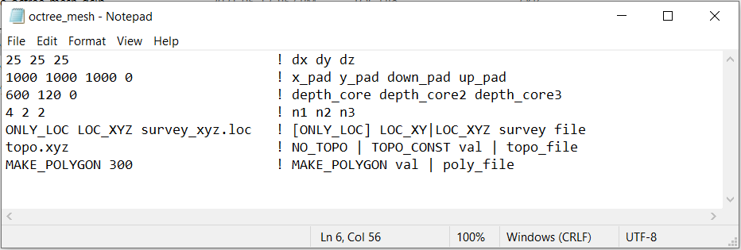
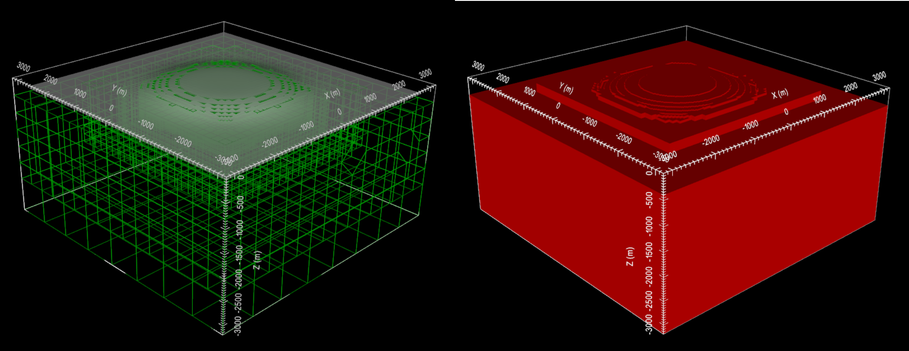

.. _example_octree_general:

Create OcTree Mesh
==================

Here, the code **create_octree_mesh_dcip.exe** and the input file **octree_mesh.inp** (:ref:`see format <dcip_input_octree>`) are used to create an OcTree mesh based on the set of electrode locations and surface topography. Files relevant to this part of the example are in the sub-folder *octree_mesh*.

Before running this example, you may want to do the following:

	- `Download and open the zip folder containing the entire DCIP octree example <https://github.com/ubcgif/DCIPoctree/raw/master/assets/dcipoctree_example_general.zip>`__ (if not done already)
	- :ref:`Learn how to run code from command line <dcip_octree>`
	- :ref:`Learn the format of the input file <dcip_input_octree>`

For our example, the :ref:`survey file <surveyFile>` uses the 'general format'. This means the survey file has elevation columns for the electrodes (the example just has columns of zeros). Please we aware that the true electrode locations at the surface may live above the discrete surface topography defined by the mesh and its :ref:`active cells model <activeFile>`. To ensure you do not model any surface electrodes as living in the air, use the **data_Z.txt** file output by **create_octree_mesh_dcip.exe** when doing subsequent forward modeling.

To generate the OcTree mesh, the following input file was used:

Below we plot the resulting OcTree mesh and original topography (left) as well as the active cells model (right). The active cells model defines the discrete surface topography by assigning a 1 to cells that are in the ground and a 0 to cells that are in the air.

