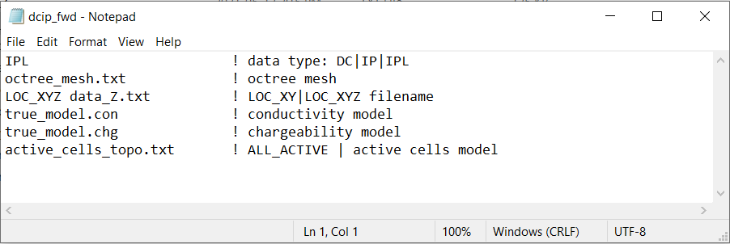
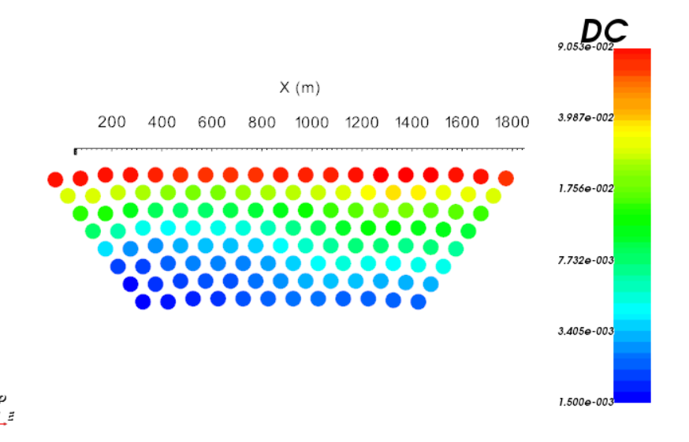
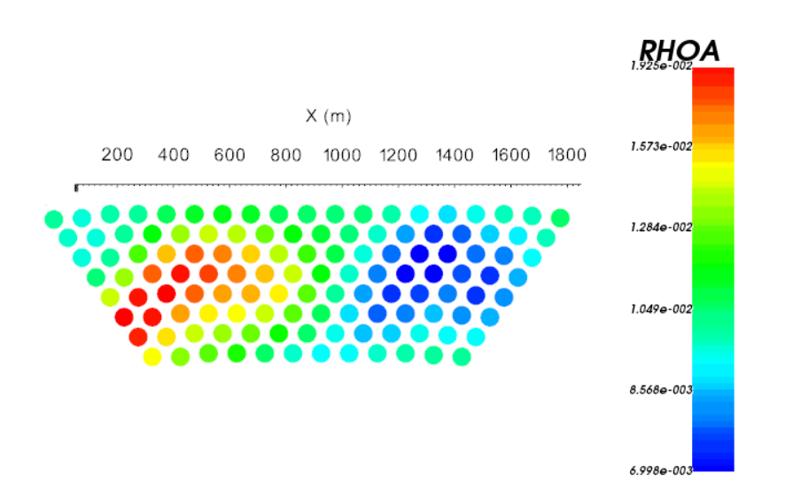
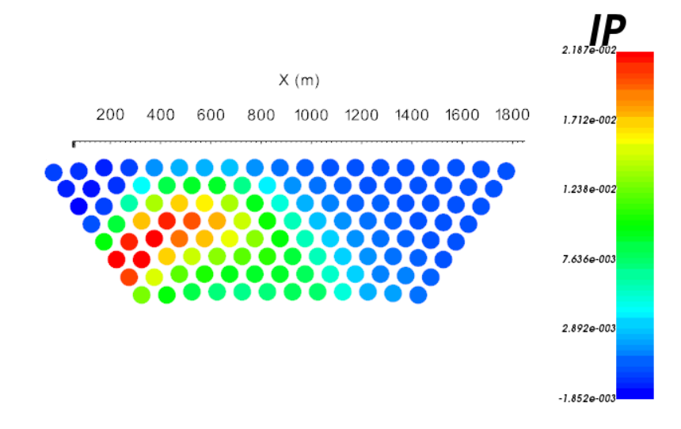

.. _example_fwd_general:

Forward Modeling
================

Here, the code **dcipoctree_fwd.exe** and the input file **dcip_fwd.inp** (:ref:`see format <dcip_input_fwd>`) are used to forward model DC and IP data along 9 pole-dipole profile lines oriented West to East. Files relevant to this part of the example are in the sub-folder *fwd*. For this example, we use the models that were created in the example ":ref:`create model<example_model>`". Before running this example, you may want to do the following:

	- `Download and open the zip folder containing the entire DCIP octree example <https://github.com/ubcgif/DCIPoctree/raw/master/assets/dcipoctree_example_general.zip>`__ (if not done already)
	- :ref:`Learn how to run code from command line <dcip_fwd>`
	- :ref:`Learn the format of the input file <dcip_input_fwd>`

To forward model the data, the following input file was used. Because the original survey file (*survey_xyz.loc*) used the general format, we instead define the electrode locations in the forward modeling with **data_Z.txt**. The file **data_Z.txt** was output by **create_octree_mesh_dcip.exe** when creating the mesh and ensures near surface electrode are projected to the discretize surface topography. 

By choosing the *IPL* flag on the first line of the input file, we are modeling DC and IP data. And a linearized formulation for modeling the IP data is used. The DC data are the measured voltage normalized by the transmitter current (V/A). The code also outputs the corresponding apparent resistivity values. The IP data are the IP voltage normalized by the DC voltage (V/V). Below, we show the 2D pseudo-sections for data collected along profile line 5 (Northing = 0 m).

**Voltage Data (V/V)**

**Apparent Resistivity (Ohm m)**

**Apparent Chargeability (V/V)**

