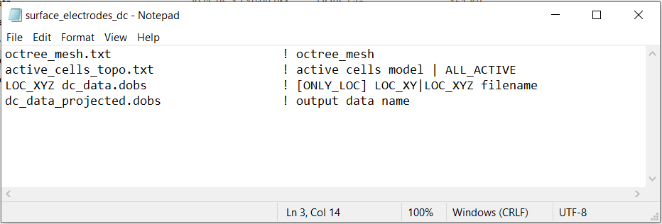
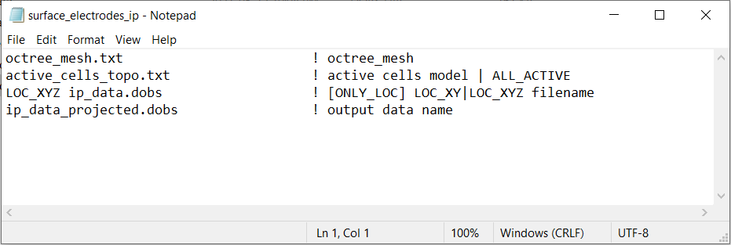

.. _example_projection_general:

Project to Discrete Surface
===========================

Here, the executable **surface_electrodes.txt** is used to project surface electrodes in general formatted DC/IP files to the discrete surface topography. When supplied with a general formatted survey/observations file, this step is carried out to ensure surface electrodes are not modeled as living above the discrete surface topography. For original survey files **dc_data.dobs** and **ip_data.dobs**, we will create observations files **dc_data_projected.dobs** and **ip_data_projected.dobs**. The projected data files are necessary for constructing sensitivity weights and performing the inversion. 

Files relevant to this part of the example are in the sub-folder *surface_electrodes*. Before running this example, you may want to do the following:

	- `Download and open the zip folder containing the entire DCIP octree example <https://github.com/ubcgif/DCIPoctree/raw/master/assets/dcipoctree_example_general.zip>`__ (if not done already)
	- :ref:`Learn how to run code from command line <dcip_surface_electrodes>`
	- :ref:`Learn the format of the input file <dcip_input_surface_electrodes>`

To create **dc_data_projected.dobs** from the original observations file **dc_data.dobs**, the following input file was used:

To create **ip_data_projected.dobs** from the original observations file **ip_data.dobs**, the following input file was used:

