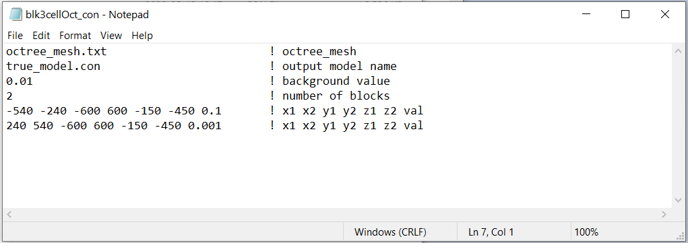
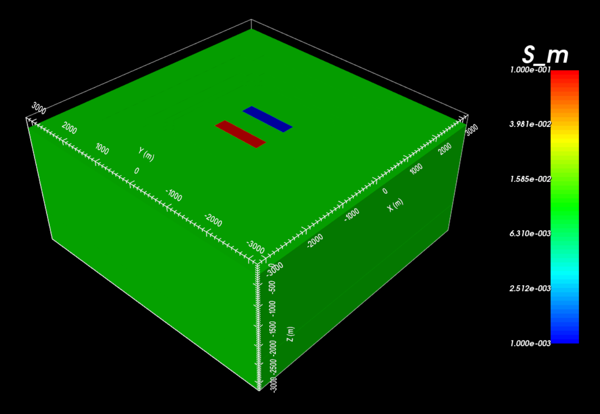
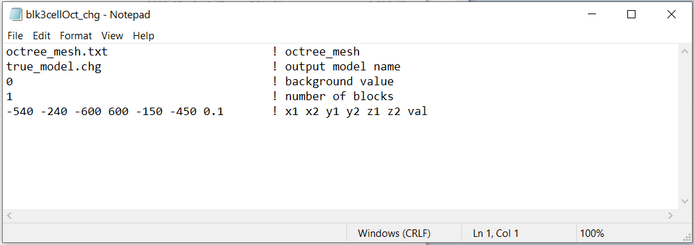
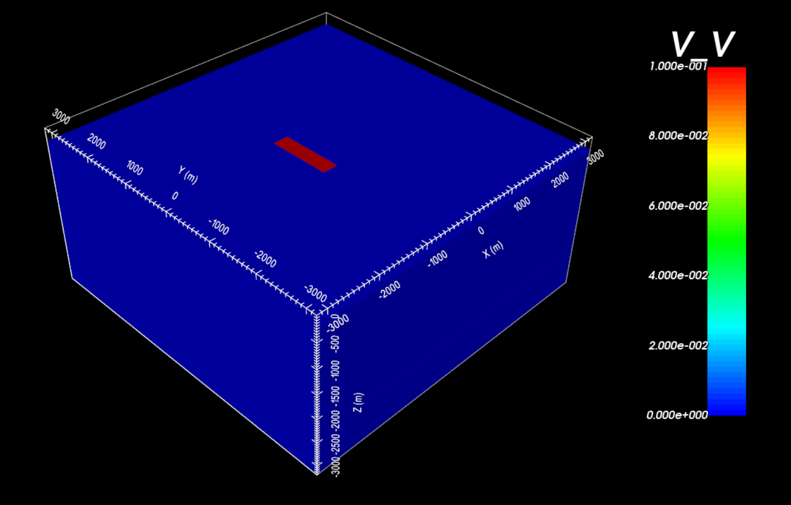

.. _example_model_surface:

Create Model
============

Here, the code **blk3cellOct.exe** is used to create both a conductivity and an intrinsic chargeability model on the OcTree mesh. For this example, we use the mesh that was created in the example ":ref:`create OcTree mesh<example_octree>`". Files relevant to this part of the example are in the sub-folder *octree_model*. Before running this example, you may want to do the following:

	- `Download and open the zip folder containing the entire DCIP octree example <https://github.com/ubcgif/DCIPoctree/raw/master/assets/dcipoctree_example_surface.zip>`__ (if not done already)
	- Learn how to run :ref:`blk3cellOct<dcip_model>`
	- Learn the format of the input files :ref:`blk3cellOct.inp<dcip_input_model>`

.. important:: If you have topography, do not worry about defining a value for the air cells. When forward modeling or inverting DC/IP data, the code will use the :ref:`active cells model <activeFile>` to determine which cells are in the air and assign an appropriate value.

**Conductivity model:** Here is the input file used to construct the conductivity model (**blk3cellOct_con.inp**)

The resulting Octree model shows a more conductive block (:math:`\sigma` = 0.1 S/m) to the West and a more resistive block (:math:`\sigma` = 0.001 S/m) to the East within a moderatively conductive background (:math:`\sigma_b` = 0.01 S/m).

**Chargeability model:** Here is the input file used to construct the chargeability model (**blk3cellOct_chg.inp**)

The resulting Octree model shows the more conductive block to the West is chargeable (:math:`\eta` = 0.1 V/V), but the more more resistive block to the East is not. The background is also non-chargeable.

