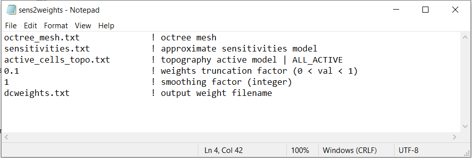
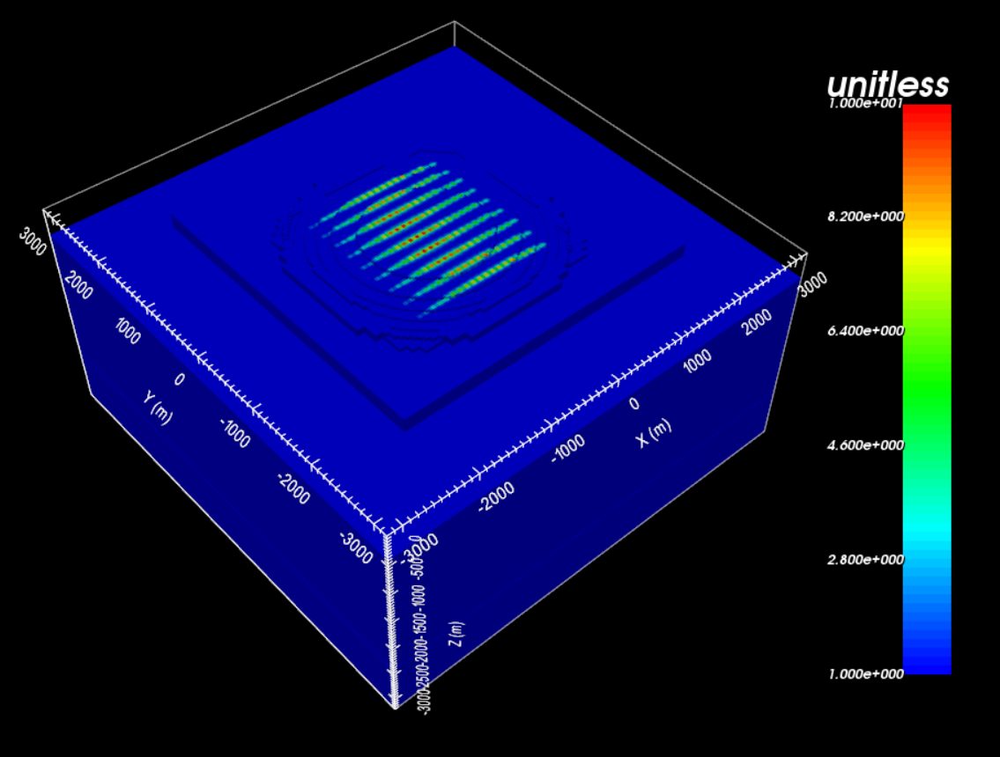
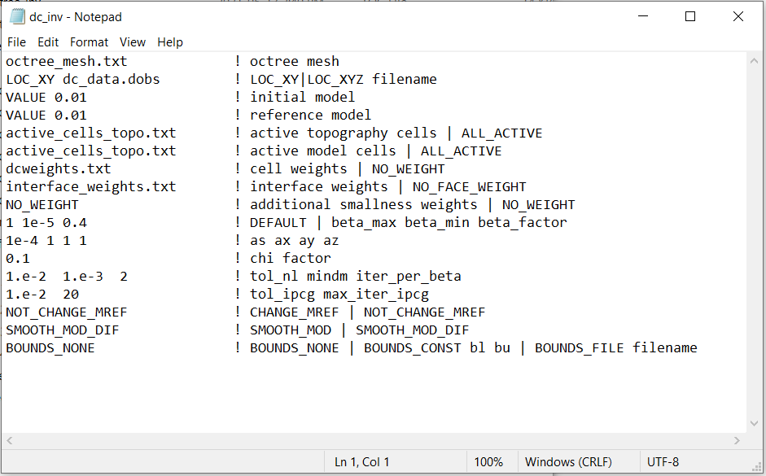
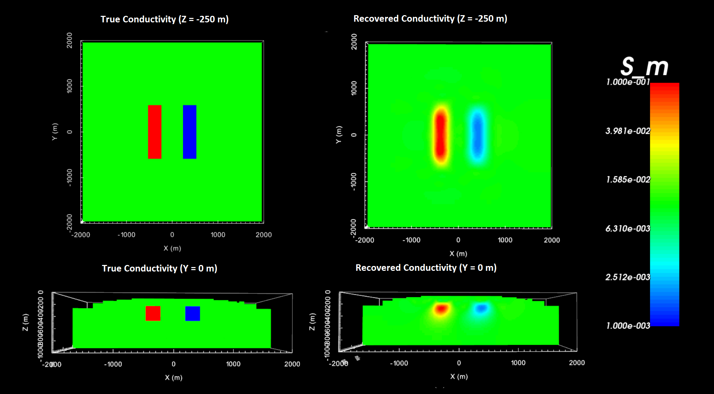

.. _example_dcinv_surface:

DC Inversion
============

Here, we use **dcsensitivity.exe** and **sens2weights.exe** to compute sensitivity weights for the DC inversion. Then we use the code **dcoctree_inv.exe** to recover a conductivity model. Because this is a simple example with no noise, we assigned a uncertainties of 1e-8 V + 1% to all DC data. In practice, data are noisy and choosing appropriate uncertainties is very important for successful inversion.

.. note:: Depending on the application, sensitivity and/or interface weighting may or may not improve the final model. Here we apply the weights to promote familiarity with this code. For this example, the data are very-well constrained by the data and significant weighting may not even be necessary.

Sensitivity Weights
-------------------

Here, the code **dcsensitivity.exe** and the input file **dcsens.inp** (:ref:`see format <dcip_input_sens>`) are used to approximate the sensitivities. Then the code **sens2weights.exe** and the input file **sens2weights.inp**create a sensitivity weights file. This counteracts the inversion's natural tendancy to incorrectly place anomalous structures near the electrodes. Files relevant to this part of the example are in the sub-folder *dc_sensitivities* . Before running this example, you may want to do the following:

    - `Download and open the zip folder containing the entire DCIP octree example <https://github.com/ubcgif/DCIPoctree/raw/master/assets/dcipoctree_example_surface.zip>`__ (if not done already)
    - :ref:`Learn how to run code from command line <dcip_sensitivity_weights>`
    - :ref:`Learn the format of the input file <dcip_input_sens>`

To compute the sensitivities, the following input file was used:

.. figure:: images/dcsens_input.PNG
     :align: center
     :width: 700

To generate the sensitivity weights file, the following input file was used:

The final sensitivity weights for the DC inversion is shown below.

DC Inversion
------------

Here we use the code **dcoctree_inv.exe** to recover a conductivity model. Before running the example, you may want to:

    - `Download and open the zip folder containing the entire DCIP octree example <https://github.com/ubcgif/DCIPoctree/raw/master/assets/dcipoctree_example_surface.zip>`__ (if not done already)
    - :ref:`Learn how to run code from command line <dc_inv>`
    - :ref:`Learn the format of the input file <dcip_input_dcinv>`

Files relevant to this part of the example are in the sub-folder *dc_inv*. To invert the synthetic data, the input file below (**dc_inv.inp**) was used. For formatting, :ref:`see format <dcip_input_dcinv>` :

The true model (left) and the final recovered model (right) are shown below.

