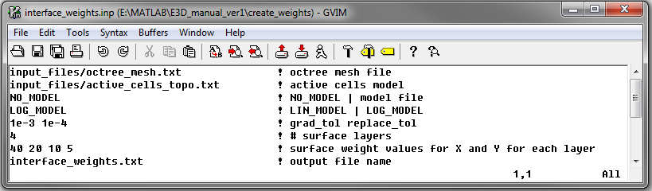

.. _example_weights_surface:

Interface Weights
=================

.. important:: Depending on the application, interface weighting may or may not improve the final inversion result.

Here, the utility code **interface_weights.exe** and the input file **interface_weights.inp** (:ref:`see format <dcip_input_weights>`) are used to create surface interface weights. Interface weighting is sometimes used to reduce artifacts in the recovered model clustered around the electrode locations. It does this by enforcing stronger lateral smoothing in the top few layers of cells.

Files relevant to this part of the example are in the sub-folder *interface_weights*. Before running this example, you may want to do the following:

	- `Download and open the zip folder containing the entire DCIP octree example <https://github.com/ubcgif/DCIPoctree/raw/master/assets/dcipoctree_example_surface.zip>`__ (if not done already)
	- :ref:`Learn how to run code from command line <dcip_interface_weights>`
	- :ref:`Learn the format of the input file <dcip_input_face_weights>`

To generate the interface weights, the following input file was used:

