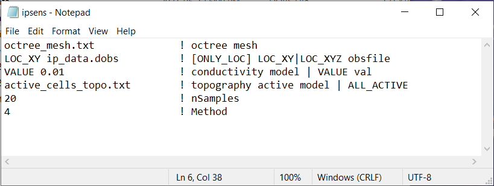
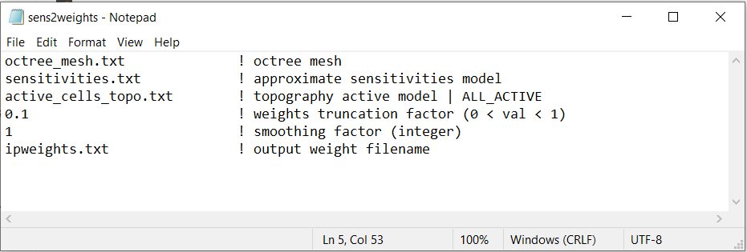
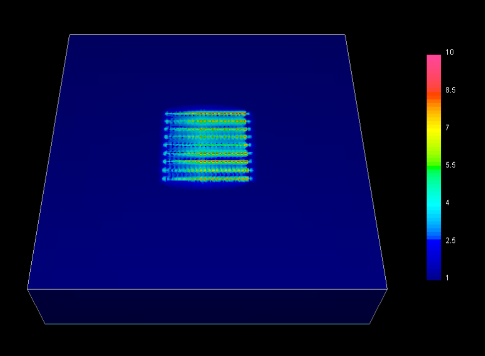
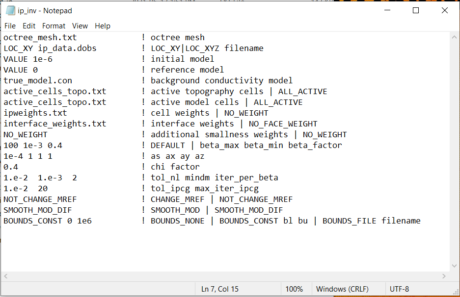
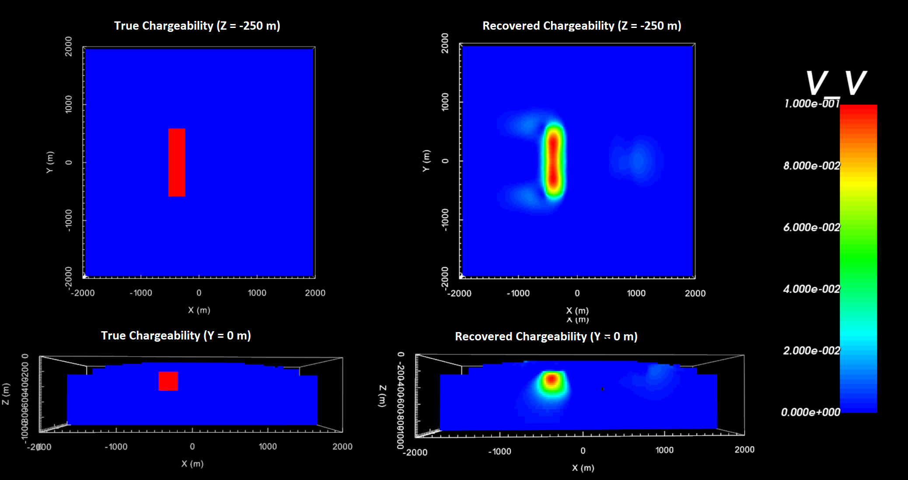

.. _example_ipinv_surface:

IP Inversion
============

Here, demonstrate how to use **dcsensitivity.exe** and **sens2weights.exe** to compute sensitivity weights for the IP inversion. It should be noted that we have chosen not to include sensitivity weights in the IP inversion example.

We use the code **ipoctree_inv.exe** to recover a chargeability model. Because this is a simple example with no noise, we assigned a uncertainties of 0.0005 to all IP data. In practice, data are noisy and choosing appropriate uncertainties is very important for successful inversion.

.. note:: Depending on the application, sensitivity and/or interface weighting may or may not improve the final model. We apply the weights to promote familiarity with this code. For this example, the data are very-well constrained by the data and significant weighting may not even be necessary.

Sensitivity Weights
-------------------

Here, the code **dcsensitivity.exe** and the input file **ipsens.inp** (:ref:`see format <dcip_input_sens>`) are used to approximate the sensitivities for the IP problem. Then the code **sens2weights.exe** and the input file **sens2weights.inp** create a sensitivity weights file. This counteracts the inversion's natural tendancy to incorrectly place anomalous structures near the electrodes. Files relevant to this part of the example are in the sub-folder *ip_sensitivities* . Before running this example, you may want to do the following:

    - `Download and open the zip folder containing the entire DCIP octree example <https://github.com/ubcgif/DCIPoctree/raw/master/assets/dcipoctree_example_surface.zip>`__ (if not done already)
    - :ref:`Learn how to run code from command line <dcip_sensitivity_weights>`
    - :ref:`Learn the format of the input file <dcip_input_sens>`

To compute the sensitivities, the following input file was used:

To generate the sensitivity weights file, the following input file was used:

The final sensitivity weights for the IP inversion is shown below.

.. important:: Although we demonstrate how to compute sensitivity weights here, we will not include them in the IP inversion.

IP Inversion
------------

Here we use the code **ipoctree_inv.exe** to recover a conductivity model. Before running this example, you may want to do the following:

    - `Download and open the zip folder containing the entire DCIP octree example <https://github.com/ubcgif/DCIPoctree/raw/master/assets/dcipoctree_example_surface.zip>`__ (if not done already)
    - :ref:`Learn how to run code from command line <ip_inv>`
    - :ref:`Learn the format of the input file <dcip_input_ipinv>`

Files relevant to this part of the example are in the sub-folder *ip_inv*. To invert the synthetic data, the input file below (**ip_inv.inp**) was used. For formatting, :ref:`see format <dcip_input_ipinv>` :

The true model (left) and the final recovered model (right) are shown below.

