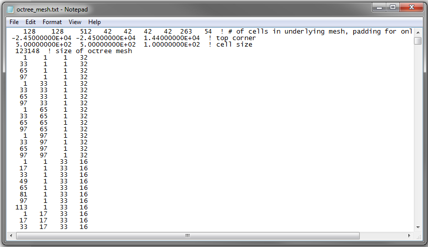

.. _octreeFile:

Octree Mesh File
================

Octree meshes define the domain for which the forward modeling or inverse problem is solved. The format of Octree mesh files is as follows:

|
| :ref:`nx<octreeFile_1>` :math:`\;` :ref:`ny<octreeFile_1>` :math:`\;` :ref:`nz<octreeFile_1>` :math:`\;` :ref:`xpL<octreeFile_2>` :math:`\;` :ref:`xpU<octreeFile_2>` :math:`\;` :ref:`ypL<octreeFile_2>` :math:`\;` :ref:`ypU<octreeFile_2>` :math:`\;` :ref:`zpL<octreeFile_2>` :math:`\;` :ref:`zpU<octreeFile_2>`
| :ref:`x0<octreeFile_3>` :math:`\;` :ref:`y0<octreeFile_3>` :math:`\;` :ref:`z0<octreeFile_3>`
| :ref:`dx<octreeFile_4>` :math:`\;` :ref:`dy<octreeFile_4>` :math:`\;` :ref:`dz<octreeFile_4>`
| :ref:`N<octreeFile_5>`
| :ref:`Lx_1<octreeFile_6>` :math:`\;` :ref:`Ly_1<octreeFile_6>` :math:`\;` :ref:`Lz_1<octreeFile_6>` :math:`\;` :ref:`M_1<octreeFile_6>`
| :ref:`Lx_2<octreeFile_6>` :math:`\;` :ref:`Ly_2<octreeFile_6>` :math:`\;` :ref:`Lz_2<octreeFile_6>` :math:`\;` :ref:`M_2<octreeFile_6>`
| :math:`\;\;\;\;\;\;\;\;\;\;\;\;\;\;\;\;\vdots`
| :ref:`Lx_N<octreeFile_6>` :math:`\;` :ref:`Ly_N<octreeFile_6>` :math:`\;` :ref:`Lz_N<octreeFile_6>` :math:`\;` :ref:`M_N<octreeFile_6>`
|
|
| 

An example of an octree mesh file is shown below

Parameter Descriptions
----------------------

.. _octreeFile_1:

        - **nx  ny  nz:** Dimensions of the mesh in x, y and z respectively, in terms of the number of base mesh cells (cells of smallest size). Thus the mesh has dimensions :math:`[nx \times dx, ny \times dy, nz \times dz]`.

.. _octreeFile_2:

        - **xpL xpU ypL ypU zpL zpU:** These parameters set the padding distance, relative to the core region, in terms of the number of base mesh cells. For example, the region of padding cells in the southern direction (defined by *xpL*) has a width of :math:`xpL \times dy`.

.. _octreeFile_3:

        - **x0 y0 z0:** The x, y and z location denoting the **top southwest corner** of the mesh

.. _octreeFile_4:

        - **dx dy dz:** Sets the x, y and z widths of the base mesh cells (smallest cells)

.. _octreeFile_5:

        - **N:** Total number of cells in the mesh. Note that :math:`nx \times ny \times nz \neq N`

.. _octreeFile_6:

        - **Lx_i Ly_i Lz_i M_i:** The location and dimensions of each cell i=1,...,N is defined by 4 parameters. *Lx_i* defines how many base cell widths in the x direction (i.e. dx) the top southwest corner of this cell is from the top southwest corner of the mesh plus one; i.e. the cell is :math:`dx \times (Lx-1)` metres from the top southwest corner in the x direction. This is likewise for *Ly_i* and *Lz_i*. *M_i* defines the width of the cell in x,y and z in terms of the number of base mesh cells. Thus, the volume of each cell is :math:`V = dx \times dy \times dz \times M^3`

.. note::

        - Cell locations are defined by their distances from the top southwest corner.
        - See the first cell defined in the Octree mesh file (line 5). The top southwest corner if this cell corresponds with that of the mesh. However, its location is defined as 1 1 1 instead of 0 0 0 due to convention.

