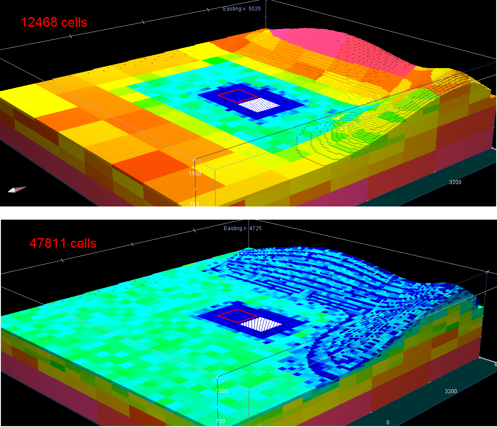

.. _dcip_input_octree:

Create OcTree Mesh Input File
=============================

The :ref:`OcTree mesh<octreeFile>` used in the DCIP octree code are created using the program **create_octree_mesh_dcip.exe**. Parameters necessary for defining the OcTree mesh are set in the input file. The lines within the input file are as follows:

.. tabularcolumns:: |C|C|C|

+--------+-----------------------------------------------------------+-----------------------------------------------------------------+
| Line # | Parameter                                                 | Descriptions                                                    |
+========+===========================================================+=================================================================+
| 1      |:ref:`dx dy dz<dcip_input_octreeln1>`                      | min. cell widths in x, y and z for base mesh                    |
+--------+-----------------------------------------------------------+-----------------------------------------------------------------+
| 2      |:ref:`x_pad y_pad down_pad up_pad<dcip_input_octreeln2>`   | sets the thickness of padding in x, y, down and up directions   |
+--------+-----------------------------------------------------------+-----------------------------------------------------------------+
| 3      |:ref:`h1 h2 h3<dcip_input_octreeln3>`                      | sets cell sizes within core mesh region                         |
+--------+-----------------------------------------------------------+-----------------------------------------------------------------+
| 4      |:ref:`n1 n2 n3<dcip_input_octreeln4>`                      | sets thickness of cells of finest discretization near receivers |
+--------+-----------------------------------------------------------+-----------------------------------------------------------------+
| 5      |:ref:`locFile<dcip_input_octreeln5>`                       | the file containing transmitters and observation locations      |
+--------+-----------------------------------------------------------+-----------------------------------------------------------------+
| 6      |:ref:`topoFile<dcip_input_octreeln6>`                      | sets topography                                                 |
+--------+-----------------------------------------------------------+-----------------------------------------------------------------+
| 7      |:ref:`shift_data<dcip_input_octreeln7>`                    | *description needed. leave as NOT_SHIFT_DATA*                   |
+--------+-----------------------------------------------------------+-----------------------------------------------------------------+
| 8      |:ref:`interp_topo<dcip_input_octreeln8>`                   | sets level of discretization for surface topography             |
+--------+-----------------------------------------------------------+-----------------------------------------------------------------+

.. figure:: images/create_octree_input.png
     :align: center
     :width: 700

     Example input file for creating octree mesh (`Download <https://github.com/ubcgif/E3D/raw/e3d/assets/dcip_input/octree_mesh.inp>`__ )

Line Descriptions
^^^^^^^^^^^^^^^^^

.. _dcip_input_octreeln1:

    - **dx dy dz:** Minimum cell widths in x, y and z for the base mesh.

.. _dcip_input_octreeln2:

    - **x_pad y_pad down_pad up_pad:** Distance from the survey area in the x, y, downward and upward directions, respectively, that the mesh extends.

.. _dcip_input_octreeln3:

    - **h1 h2 h3:** Sets cell sizes within the core mesh region. Up to a depth of *h1* from surface topography and within a horizontal distance of *h1* from any receiver, the smallest cell size is used (set by *dx, dy, dz*). For the following *h2* metres, the cell widths are doubled. For the following *h3* metres, the cell widths are doubled again. Outside a depth and horizontal distance of *h1+h2+h3*, the cells widths increase by a factor of 2 for every additional layer (see the figure below).

.. _dcip_input_octreeln4:

    - **n1 n2 n3:** This sets the thicknesses of layers of finest discretization near the receivers. **n1 = 4** means that around each receiver, there is a layer 4 cells thick that uses the finest discretization. This is followed by a layer which is **n2** cells thick, where the cell dimensions are increased by a factor of 2. Likewise for the 3rd layer.

.. _dcip_input_octreeln5:

    - **locFile:** Contains the locations of the receivers. The user may either enter the file path to an :ref:`observed data<obsFile>` file, or the flag "ONLY_LOC" followed by the path to a :ref:`data points<surveyFile>` file. 

.. _dcip_input_octreeln6:

    - **topoFile:** If a topography file is available, the file path to the topography file is entered; see :ref:`topography file<topoFile>` for format. In the case of flat topography, the user instead enter "TOPO_CONST", followed by a space, then the elevation of the surface topography; for example "TOPO_CONST 125.5".

.. _dcip_input_octreeln7:

    - **shift_data:** If the flag "NOT_SHIFT_DATA" is used, then it is possible for transmitters and receiver to lie below the surface topography. If "SHIFT_DATA *filename*" is used, then a new survey file is output in which the transmitter and receivers have been projected to the surface topography.

.. _dcip_input_octreeln8:

    - **interp_topo:** Set as either "APPROXTOPO" or "GOODTOPO". If "APPROXTOPO" is chosen, there will only be fine cells close to the survey, whereas "GOODTOPO" will place fine cells everywhere on the surface.

Approximate versus Good Topography
^^^^^^^^^^^^^^^^^^^^^^^^^^^^^^^^^^

Below, we see the difference between entering "APPROXTOPO" (top) and "GOODTOPO" (bottom) into :ref:`interp_top<dcip_input_octreeln7>`. For "APPROXTOPO", the mesh ultimately contains a smaller total number of cells, as discretization near the surface is coarser. For "GOODTOPO", the mesh contains a larger total number of cells because the surface topography is discretized to the finest cell size.

