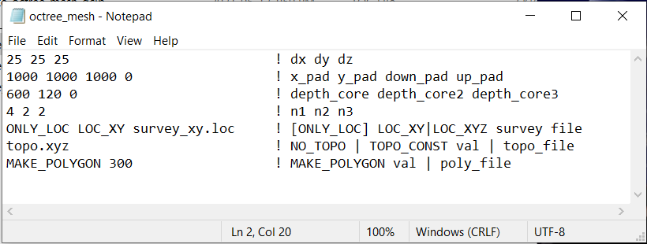

.. _dcip_input_octree:

Create OcTree Mesh Input File
=============================

The :ref:`OcTree mesh<octreeFile>` used in the DCIP octree code are created using the program **create_octree_mesh_dcip.exe**. Parameters necessary for defining the OcTree mesh are set in the input file. The lines within the input file are as follows:

.. tabularcolumns:: |C|C|C|

+--------+----------------------------------------------------------------+-----------------------------------------------------------------+
| Line # | Parameter                                                      | Descriptions                                                    |
+========+================================================================+=================================================================+
| 1      |:ref:`dx dy dz<dcip_input_octreeln1>`                           | min. cell widths in x, y and z for base mesh                    |
+--------+----------------------------------------------------------------+-----------------------------------------------------------------+
| 2      |:ref:`x_pad y_pad down_pad up_pad<dcip_input_octreeln2>`        | sets the thickness of padding in x, y, down and up directions   |
+--------+----------------------------------------------------------------+-----------------------------------------------------------------+
| 3      |:ref:`depth_core depth_core2 depth_core3<dcip_input_octreeln3>` | sets cell sizes within core mesh region                         |
+--------+----------------------------------------------------------------+-----------------------------------------------------------------+
| 4      |:ref:`n1 n2 n3<dcip_input_octreeln4>`                           | sets thickness of cells of finest discretization near receivers |
+--------+----------------------------------------------------------------+-----------------------------------------------------------------+
| 5      |:ref:`locFile<dcip_input_octreeln5>`                            | the file containing electrode locations                         |
+--------+----------------------------------------------------------------+-----------------------------------------------------------------+
| 6      |:ref:`topoFile<dcip_input_octreeln6>`                           | sets topography                                                 |
+--------+----------------------------------------------------------------+-----------------------------------------------------------------+
| 7      |:ref:`interp_topo<dcip_input_octreeln7>`                        | sets level of discretization for surface topography             |
+--------+----------------------------------------------------------------+-----------------------------------------------------------------+

     Example input file for creating octree mesh (`Download <https://github.com/ubcgif/DCIPoctree/raw/master/assets/dcip_input/octree_mesh.inp>`__ )

Line Descriptions
^^^^^^^^^^^^^^^^^

.. _dcip_input_octreeln1:

    - **dx dy dz:** Minimum cell widths in x, y and z for the base mesh.

.. _dcip_input_octreeln2:

    - **x_pad y_pad down_pad up_pad:** Distance from the survey area in the x, y, downward and upward directions, respectively, that the mesh extends.

.. _dcip_input_octreeln3:

    - **depth_core depth_core2 depth_core3:** Sets cell sizes within the core mesh region. Up to a depth of *core_depth* from surface topography and within a horizontal distance of *core_depth* from any electrode, the smallest cell size is used (set by *dx, dy, dz*). Then up to a distance of *core_depth2* , the cell widths are 2 times the minimum. The up to a distance of *core_depth3* , the cell widths are again increased by a factor of 2. Outside a depth and horizontal distance of *core_depth3*, the cells widths increase by a factor of 2 for every additional layer (see the figure below).

.. _dcip_input_octreeln4:

    - **n1 n2 n3:** This sets the thicknesses of layers of finest discretization near the receivers. **n1 = 4** means that around each receiver, there is a layer 4 cells thick that uses the finest discretization. This is followed by a layer which is **n2** cells thick, where the cell dimensions are increased by a factor of 2. Likewise for the 3rd layer.

.. _dcip_input_octreeln5:

    - **locFile:** This line defines the electrode locations. The general syntax is *[ONLY_LOC] LOC_XY|LOC_XYZ filepath*.

        - *ONLY_LOC:* If you are using a :ref:`survey file <surveyFile>` , then you must begin this line with the *ONLY_LOC* flag. If you are using a :ref:`observations file <obsFile>` , this first flag is not required.
        - *LOC_XY|LOC_XYZ:* For surface formatted files, use the flag *LOC_XY* and the code will project the electrodes to the discrete surface topography. If the flag *NO_TOPO* the *topoFile* line, the electrodes are located a the top of the mesh. For general formatted files, use the flag *LOC_XYZ* and the true xyz electrode locations are preserved.
        - *filepath:* This is the filepath to the survey/observations file. 
    

.. _dcip_input_octreeln6:

    - **topoFile:** If a topography file is available, the file path to the topography file is entered; see :ref:`topography file<topoFile>` for format. In the case of flat topography, the user instead enter *TOPO_CONST*, followed by a space, then the elevation of the surface topography; for example *TOPO_CONST 125.5*. For a flat topography at 0, use the flag *NO_TOPO*.

.. _dcip_input_octreeln7:

    - **polygon edge width:** Here we define the horizontal extent of the core inversion mesh region. The user may do this by providing the path to a file containing the points for a polygon. The user may also set the horizontal extent of the core mesh region based on transmitter and receiver locations. The set of transmitter and receiver locations can be used to create a convex hull. For this option the user types *MAKE_POLYGON d*, where *d* is the distance outside the convex hull the user want to extend to core mesh region.

