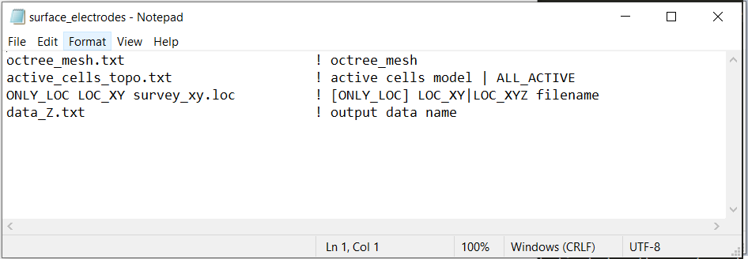

.. _dcip_input_surface_electrodes:

Project Electrodes to Surface
=============================

The executable **surface_electrodes.exe** is used for one of two reasons:

    1. You have a 'surface formatted' :ref:`survey <surveyFile>`/:ref:`observations <obsFile>` file and you want to convert it to 'general format' with all electrodes located on the discretized surface topography.
    2. You have a 'general formatted' survey/observations file with electrodes on the true topography, and you need to project electrodes in air cells to the discretized surface topography.

The input file containing the input parameters for this executables is formatted as follows:

.. tabularcolumns:: |L|C|C|

+--------+------------------------------------------------------+--------------------------------------------------------------------------------------+
| Line # | Parameter                                            | Description                                                                          |
+========+======================================================+======================================================================================+
| 1      | :ref:`OcTree Mesh<dcip_input_surf_ln1>`              | path to octree mesh                                                                  |
+--------+------------------------------------------------------+--------------------------------------------------------------------------------------+
| 2      | :ref:`Active Cells<dcip_input_surf_ln2>`             | path to active cells model                                                           |
+--------+------------------------------------------------------+--------------------------------------------------------------------------------------+
| 3      | :ref:`Survey/Observations File<dcip_input_surf_ln3>` | path to survey/observations file                                                     |
+--------+------------------------------------------------------+--------------------------------------------------------------------------------------+
| 4      | :ref:`Output Name<dcip_input_surf_ln4>`              | name for output face weighting file                                                  |
+--------+------------------------------------------------------+--------------------------------------------------------------------------------------+

     Example input file (`Download <https://github.com/ubcgif/DCIPoctree/raw/master/assets/dcip_input/surface_electrodes.inp>`__ ).

.. _dcip_input_surf_lines:

Line Descriptions
^^^^^^^^^^^^^^^^^

.. _dcip_input_surf_ln1:

    - **OcTree Mesh:** file path to the OcTree mesh file

.. _dcip_input_surf_ln2:

    - **Active Topography Cells:** Here, the user can choose to specify the cells which lie below the surface topography. To do this, the user may supply the file path to an active cells model file or type "ALL_ACTIVE". The active cells model has values 1 for cells lying below the surface topography and values 0 for cells lying above.

.. _dcip_input_surf_ln3:

    - **Survey/Observations File:** The general syntax is *[ONLY_LOC] LOC_XY|LOC_XYZ filepath*. This line defines the electrode locations using a :ref:`survey file <surveyFile>` or an :ref:`observations file <obsFile>`.

        - *ONLY_LOC:* If you are using a survey file, then you must begin this line with the *ONLY_LOC* flag. If you are using an observations file, this flag is omitted.

        - *LOC_XY|LOC_XYZ:*

            - Use the flag *LOC_XY* for surface formatted survey/observations files. The code will output a file where elevation columns have been added assuming the electrodes live on the discretize surface topography.
            - Use the flag *LOC_XYZ* for general formatted survey/observations files. In the file output by the code, any electrodes that were above the discrete surface topography are projected to the discrete surface. And all other electrodes are left in their original locations.

        - *filepath:* This is the filepath to the survey/observations file.

.. _dcip_input_surf_ln4:

    - **Output Name:** File name for the output survey/observations file.
