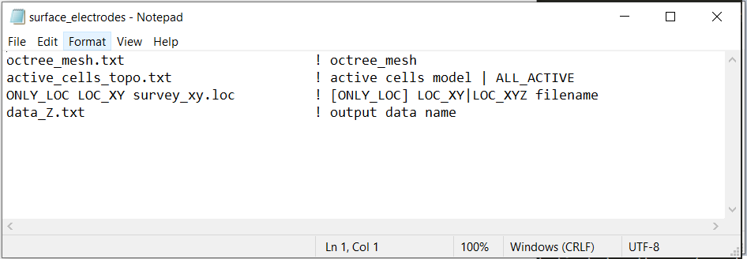

.. _dcip_input_surface_electrodes:

Project Electrodes to Surface
=============================

The parameters used to convert a surface formatted data to general format with electrodes placed on the discrete topography are defined in the following input file. The lines within the input file are as follows:

.. tabularcolumns:: |L|C|C|

+--------+------------------------------------------------------+--------------------------------------------------------------------------------------+
| Line # | Parameter                                            | Description                                                                          |
+========+======================================================+======================================================================================+
| 1      | :ref:`OcTree Mesh<dcip_input_surf_ln1>`              | path to octree mesh                                                                  |
+--------+------------------------------------------------------+--------------------------------------------------------------------------------------+
| 2      | :ref:`Active Cells<dcip_input_surf_ln2>`             | path to active cells model                                                           |
+--------+------------------------------------------------------+--------------------------------------------------------------------------------------+
| 3      | :ref:`Survey/Observations File<dcip_input_surf_ln3>` | path to survey/observations file                                                     |
+--------+------------------------------------------------------+--------------------------------------------------------------------------------------+
| 4      | :ref:`Output Name<dcip_input_surf_ln4>`              | name for output face weighting file                                                  |
+--------+------------------------------------------------------+--------------------------------------------------------------------------------------+

     Example input file (`Download <https://github.com/ubcgif/DCIPoctree/raw/master/assets/dcip_input/surface_electrodes.inp>`__ ).

.. _dcip_input_weights_lines:

Line Descriptions
^^^^^^^^^^^^^^^^^

.. _dcip_input_surf_ln1:

    - **OcTree Mesh:** file path to the OcTree mesh file

.. _dcip_input_surf_ln2:

    - **Active Topography Cells:** Here, the user can choose to specify the cells which lie below the surface topography. To do this, the user may supply the file path to an active cells model file or type "ALL_ACTIVE". The active cells model has values 1 for cells lying below the surface topography and values 0 for cells lying above.

.. _dcip_input_surf_ln3:

    - **Survey/Observations File:** This line defines the electrode locations. The general syntax is *[ONLY_LOC] LOC_XY|LOC_XYZ filepath*.

        - *ONLY_LOC:* If you are using a :ref:`survey file <surveyFile>` , then you must begin this line with the *ONLY_LOC* flag. If you are using a :ref:`observations file <obsFile>` , this first flag is not required.
        - *LOC_XY|LOC_XYZ:* For surface formatted files, use the flag *LOC_XY*. For general formatted files, use the flag *LOC_XYZ*.
        - *filepath:* This is the filepath to the survey/observations file.

.. _dcip_input_surf_ln4:

    - **Output Name:** File name for the output survey/observations file.
