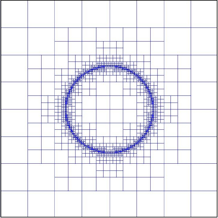

.. _overview:

DCIPoctree package overview
===========================

New capabilities
----------------

DCIP3D for octree meshes is a program library for carrying out forward modelling and inversion of DC resistivity and induced polarization data over 3D structures. The forward and inverse modeling is done on a pre-defined base (underlaying) mesh, which can be selectively refined as per curvature amplitude, as dictated by property variations. Version 1.0 of the code is a newly developed algorithm, which has been developed for increased computational efficiency and higher level of modeling accuracy. The code is designed to replicate the capabilities available in the old UBC-GIF DCIP3D program library and its functionality, allows working with old data formats, whenever possible. In addition to the forward modeling and inversion routines, the program library includes numerous utility executables, designed to facilitate the transition from regular to octree meshes  and to support format exchange between the new and the old code versions.

In addition to the new approach in discretization, DCIPoctree has been released with implemented parallelization using OpenMP, optimized for usage on multi-core computers with hyperthreading functionality. For parallel usage on local networks and commodity clusters, \programName~ has been compiled with Message Pass Interface (MPI) using the `MUMPS direct solver <http://graal.ens-lyon.fr/MUMPS/>`__. Among the newly implemented modifications to the beta version of the code, the most significant are the capability to invert borehole (subsurface) data, to drape the 2D (XY) survey geometries over 3D topography, the added ability to incorporate a-priori electrical resistivity or chargeability information by utilizing a 3D weighting function (which can be designed to emphasize or suppress some known spatial or directional features of the recovered model or otherwise, to force desired model conditions via property bound constraints), and interface weighting which can be used to define sharp contacts within the reference model (i.e. faults, unconformities, etc.) and laterally smoothing near surface variations in the recovered model.  

Boundary constraint is achieved by imposing restrictions on each cell in the mesh to have a model value of :math:`\mathbf{m}`, such that :math:`\mathbf{m}^l \leq \mathbf{m} \leq \mathbf{m}^u`, where the bounds :math:`\mathbf{m}^l` and :math:`\mathbf{m}^u`, the lower and upper bound, respectively, are prescribed by the user. The conjugate-gradient solution implements this through projected gradient techniques.

Array types and Earth models
----------------------------

All linear survey surface-array types, including non-standard or uneven arrays, as well as their combinations can be inverted. There is no restriction on array geometry or electrode positioning, as long as the electrode locations are within the extent of the mesh. Recently, capability to invert borehole data and combined surface-borehole data sets has been added to the code. 

DCIPoctree considers the subsurface in terms of a mesh of rectangular cells. Numerical accuracy is increased with usage of smaller cells, but this also drastically increases the size of the problem. The idea behind usage of octree meshes is that in order to minimize the computational costs, the discretization of the volume should be adaptive, based on the quickness of recovered property transition in each direction. :numref:`mesh` shows an example of adaptive refinement for a circular structure. 

When working with octree meshes, the underlying (base) mesh is defined as a regular 3D discretization with number of cells in each dimension equal to some power of 2. This underlying mesh is the finest possible discretization, which can be used in the inversion at any later stage, without using remeshing procedures. The idea is that if recovered model properties change slowly over a certain volume, then the cells bounded by this volume can be merged into a single cell without losing any accuracy in modelling, and only refined when the model begins changing. The spatial variability of model properties is a measure of the mesh refinement.

Program library contents
------------------------

The package that can be licensed includes the following executable programs for performing forward modelling, and inversion of 3D DC resistivity or induced polarization (IP) surveys. Additional functionality is included in supplementary utility programs, which can be used to create and refine octree meshes, calculate octree cell centres, remesh octree models, create weighting files, and convert octree model to non-octree model or vise-versa on both: Windows and Linux platforms. The package contains the following programs:

- ``DCIPoctreeFwd``: Forward model conductivity/chargeability models to calculate data.
- ``DCoctreeInv``: Invert 3D DC data to develop a conductivity model.
- ``IPoctreeInv``: Invert 3D IP data to develop a chargeablility model.
- ``create_octree_mesh``: Create an octree mesh file from electrode locations and optionally topography.
- ``3DModel2Octree``: Convert from a 3D UBC-GIF model to an octree mesh/model.
- ``octreeTo3D``: Convert from an octree model to a standard 3D UBC-GIF model.
- ``refine_octree``: Make an octree mesh finer based on the values of the input model.
- ``remesh_octree_model``: Convert a model from one octree mesh to another.
- ``surface_electrodes``: Place the electrodes on the topographic surface.
- ``octree_cell_centre``: Read in an octree mesh, and output a 3-columns file of cell centres.
- ``interface_weights``: Create a weight file for the octree cell interfaces.
- ``create_weight_file``: Create an octree cell weighting file.

Installing
----------

There is no automatic installer currently available for this package. Please follow the following stesp in order to use the software.

#. Extract all files provided from the given zip-based archive and place them all together in a new folder such as

#. Add this directory as new path to your environment variables.

One additional note about installation:

-  Do not store anything in the "bin" directory other than executable applications and Graphical User Interface applications (GUIs).
