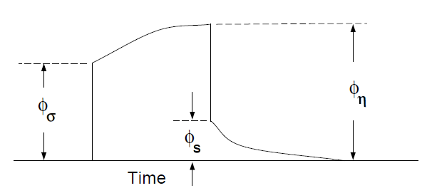
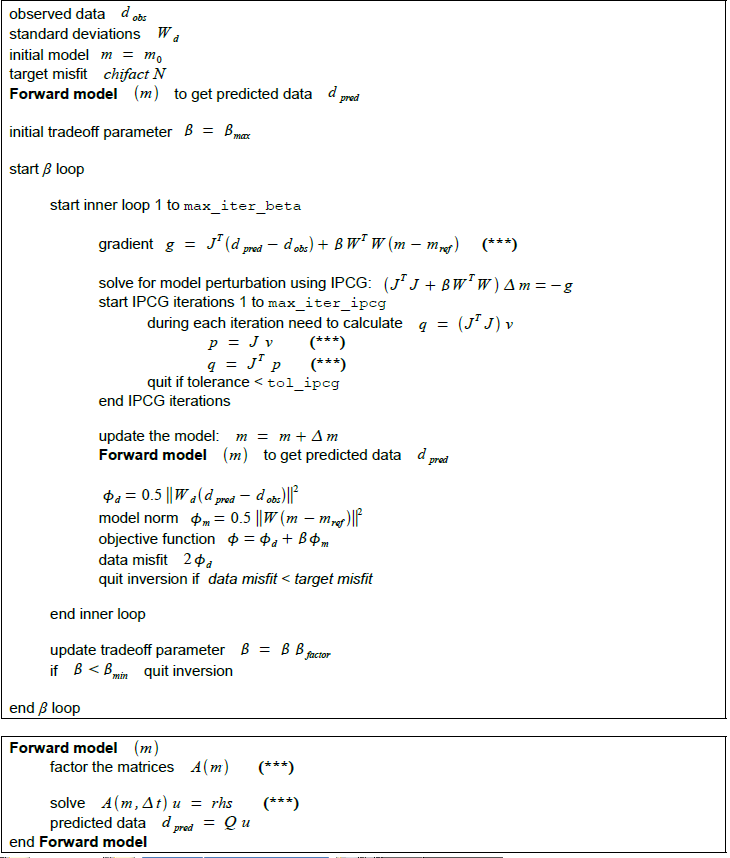

.. _theory:

Background theory
=================

Introduction
------------

This manual  presents  theoretical  background for DCIP OcTree modeling package. This suite of algorithms, developed at `UBC-GIF <gif.eos.ubc.ca>`__, is needed to efficiently invert large sets of DC potential data and IP responses over a 3D earth structure. The manual is designed so that a geophysicist who has understanding of DC resistivity and induced polarization field experiments, but who is not necessarily versed in the details of inverse theory, can use the codes to invert his or her data.

        Definition of three potentials associated with DC/IP experiments.

A typical DC/IP experiment involves inputting a current :math:`I` to the ground and measuring the potential away from the source.  In a time-domain system, the current alternates in direction and has off-times between the current pulses at which the IP voltages are measured. A typical time-domain signature is shown in :numref:`potentials`. In that figure, :math:`\phi_\sigma` is the potential that is measured in the absence of chargeability effects. This is the instantaneous value of the potential measured when the current is turned on. In mathematical terms, this potential is related to the electrical conductivity :math:`\sigma` by:

.. math::
        \phi_\sigma = \mathcal{F}_{dc}[\sigma]

where forward mapping operator :math:`\mathcal{F}_{dc}` is defined by the equation:

.. math::
        \nabla\cdot(\sigma\nabla \phi_\sigma)=-I\delta(\boldsymbol{r}-\boldsymbol{r}_s) 
        :label: DC

and appropriate  boundary  conditions.	In Equation :eq:`DC`, :math:`\sigma` is  the  electrical  conductivity  in Siemens/meter (S/m), :math:`\nabla` is the gradient operator, math:`I` is the strength of the input current in Amperes (A), and :math:`\boldsymbol{r}_s` is the location of the current source.  For typical earth structures, :math:`\sigma`, while positive, can vary over many orders of magnitude. The potential in Equation :eq:`DC` is the potential due to a single current. This is the value that would be measured in a pole-pole experiment. If potentials from pole-dipole or dipole-dipole surveys are to be generated then they can be obtained by using Equation :eq:`DC` and the principle of superposition.

When the earth material is chargeable, the measured voltage will change with time and reach a limit value which is denoted by :math:\phi_\eta: in :numref:`potentials`. There are a multitude of microscopic polarization phenomena which when combined produce this response but all of these effects can be consolidated into a single macroscopic parameter called chargeability. We denote chargeability by the symbol :math:`\eta`. Chargeability is dimensionless, positive, and confined to the region [0,1).

To carry out forward modelling to compute :math:`\phi_{\eta}`, we adopt the formulation of :cite:`Siegel1959` which states that the effect of a chargeable ground is modelled by using the DC resistivity forward mapping :math:`\mathcal{F}_{dc}` but with the conductivity replaced by :math:`\sigma=\sigma(1-\eta)`. Thus:

.. math::
        \phi_\eta=\mathcal{F}_{dc}[\sigma(1-\eta)]
        :label: Phieta

or

.. math:: 
        \nabla\cdot(\sigma(1-\eta)\nabla\phi_\eta)=-I\delta(\boldsymbol{r}-\boldsymbol{r}_s)
        :label: chargeability

The IP datum can be either the secondary potential (:math:`\phi_s`) or the apparent chargeability (:math:`\eta_a`). The former is the difference of the forward modelled potentials with, and without, the IP effect:

.. math::
        \phi_s=\phi_\eta-\phi_\sigma=\mathcal{F}_{dc}[\sigma(1-\eta)]-\mathcal{F}_{dc}[\sigma]
        :label: potentialsdiff

The apparent chargeability is then given by the ratio:

.. math:: 
        \eta_a=\frac{\phi_s}{\phi_\eta}=\frac{\mathcal{F}_{dc}[\sigma(1-\eta)]-\mathcal{F}_{dc}[\sigma]}{\mathcal{F}_{dc}[\sigma(1-\eta)]}
        :label: potentialsfrac

In this definition, the apparent chargeability is dimensionless and, in the case of data acquired over an earth  having constant chargeability :math:`\eta_0`, we have :math:`\eta_a=\eta_0`. Equations :eq:`potentialsdiff` and :eq:`potentialsfrac` show that the IP data can be computed by carrying out two DC resistivity  forward modellings with conductivities :math:`\sigma` and :math:`\sigma(1-\eta)`. The secondary potential is the more general form of IP data and the apparent chargeability is only defined when the linear (or polar) arrays are used along a line on the surface or in the same borehole. When the current and potential dipole-electrodes are arranged in 3D space and so they are not aligned, the total potential can take on positive, zero, or negative values.  The cross-line experiments on the surface and cross-hole experiment on boreholes are examples of such situations.  Because of the zero-crossing in the total potentials, the commonly used apparent chargeability is undefined. In these cases, the appropriate data to measure the IP effect is the secondary potential. Therefore, we will use secondary potential as the basic IP datum except in the case of linear arrays.

The field data from a DC/IP survey are a set of N potentials (ideally :math:`\phi_\sigma`, but usually :math:`\phi_\eta`) and a set of N secondary potentials :math:`\phi_s` or a quantity that is related to :math:`\phi_s`. The goal of the inversionist is to use these data to acquire quantitative information about the distribution of the two physical parameters of interest:  conductivity :math:`\sigma(x,y,z)` and chargeability :math:`\eta(x,y,z)`.

The distribution of conductivity and chargeability in the earth can be extremely complicated. Both quantities vary as functions of position in 3D space. In addition, there is often large topographic relief. In this program library, the 3D nature of the physical properties and surface topography are fully incorporated. The Earth model is divided into prismatic cells each having a constant value of conductivity and chargeability. The surface topography is approximated by a piecewise constant surface.

Forward modelling
-----------------

Discretized System
^^^^^^^^^^^^^^^^^^

The forward modelling for the DC potentials and IP apparent chargeabilities is accomplished using a finite volume method :cite:`DeyMorrison1979` and a pre-conditioned conjugate gradient technique.

**For the DC problem**, :eq:`DC` is discretized and the electric potential at cell centers (:math:`\boldsymbol{\phi_\sigma}`) are computed by solving the following linear system:

.. math::
	\boldsymbol{[M_c D M_{f\sigma}^{-1} D^T M_c ] \, \phi_\sigma} = \boldsymbol{q}
	:label: DC_discretized

where

	- :math:`\boldsymbol{D}` is a discretize divergence operator whose transpose acts as a modified gradient operator
	- :math:`\boldsymbol{M_c} = diag(v)` is a sparse diagonal matrix containing the cell volumes
	- :math:`\boldsymbol{M_{f\sigma}} = diag \big ( \boldsymbol{A_{fc}^T (v \odot \sigma^{-1})} \big )` where :math:`\boldsymbol{A_{fc}}` projects from faces to cell centers
	- :math:`\boldsymbol{q}` is an integrated source term that lives at cell centers.

Once the system is solved, a sparse projection matrix :math:`\mathbf{P}` maps the potentials at cell centers to the electrode positions and computes the data, i.e.:

.. math::
        \boldsymbol{d_{dc}} = \boldsymbol{P \phi_\sigma}

**For the IP problem**, the secondary potential due to the IP is computed according to :eq:`potentialsdiff`. :math:`\phi_\eta` is obtained by replacing :math:`\sigma` with :math:`\sigma (1 - \eta)` in :eq:`DC_discretized`. Therefore:

.. math::
	\boldsymbol{[M_c D M_{f\eta}^{-1} D^T M_c ] \, \phi_\eta} = \boldsymbol{q}
        :label: IP_discretized

where :math:`\boldsymbol{M_{f\eta}} = diag \big ( \boldsymbol{A_{fc}^T (v \odot \Delta\sigma^{-1} )} \big )` such that :math:`\boldsymbol{\Delta \sigma} = \boldsymbol{\sigma \odot (1 - \eta)}`.

Thus using :eq:`DC_discretized` and :eq:`IP_discretized`, the secondary potential at cell centers due to IP is:

.. math::
        \boldsymbol{\phi_s} = \boldsymbol{\phi_\eta - \phi_\sigma}

The secondary potential data is given by:

.. math::
        \boldsymbol{d_{ip}} = \boldsymbol{P \phi_s}

And the apparent chargeabilities are given by:

.. math::
        \boldsymbol{\eta_a} = \boldsymbol{P} \dfrac{\boldsymbol{\phi_\eta - \phi_\sigma}}{\boldsymbol{\phi_\eta}}

Source Term
^^^^^^^^^^^

The right-hand size of :eq:`DC_discretized` represents an integrated source term. For the DCIP OcTree package, the right-hand side is formed using an analytic primary field solution. For a homogeneous background conductivity model :math:`\boldsymbol{\sigma_0}`, a method of images approach is used to analytically compute the electric potential :math:`\boldsymbol{\phi_0}` at cell centers.

Given that we know the background model :math:`\boldsymbol{\sigma_0}` and background solution :math:`\boldsymbol{\phi_0}`, we can use :eq:`DC_discretized` to compute the associated right-hand side, i.e.:

.. math::
	\boldsymbol{[M_c D M_{f\sigma_0} D^T M_c ] \, \phi_0} = \boldsymbol{q}

.. important:: The method of images solution **does** consider topography. It is extremely accurate when the surface topography is flat, however it becomes less accurate when topography is extreme.

.. _theory_inv:

General inversion methodology
-----------------------------

The inverse problem is formulated as an optimization problem where an objective function of the model is minimized subject to the constraints in Equation :eq:`DC` for DC resistivity data or Equation :eq:`chargeability` for IP data. To outline our methodology, it is convenient to introduce a single notation for the data and for the model. We let :math:`\boldsymbol{d} = (d_1,d_2,...,d_N)^T` denote the data, where :math:`N` is the number of data. Using this notation, :math:`d_i` is either the :math:`i^{th}` potential in a DC resistivity data set, or the :math:`i^{th}` secondary potential/apparent chargeability in an IP survey. Let the physical property of interest be denoted by the generic symbol :math:`m` for the model element. The quantity :math:`m_i` denotes the conductivity or chargeability of the :math:`i^{th}` model cell. For the inversion, we choose :math:`m_i=\ln(\sigma_i)` when inverting for conductivities, and :math:`m_i=\eta_i` when reconstructing the chargeability distribution.

Having defined a model, we next construct an objective function which, when minimized, produces a model that is geophysically interpretable and reproduces the data :math:`\boldsymbol{d}` to a justifiable level based on their associated uncertainties. The details of the objective function are problem dependent but generally we need the flexibility to be close to a reference model :math:`m_o` and also require that the recovered model be relatively smooth in all three spatial directions. Here we adopt a right-handed Cartesian coordinate system with :math:`y` positive north and and :math:`z` positive up. In defining the model objective function, the reference model will generally be included in the first component of the objective function but it can be removed, if desired, from the remaining derivative terms since we are often more confident in specifying the value of the model at a particular point than in supplying an estimate of the gradient. This leads to the following two distinct formulations of the model objective function.

.. math::
        \Phi_m =  &&\alpha_s\int\int\ w_s(m-m_0)^2dv + \alpha_x\int\int w_x\left(\frac{\partial{(m-m_0)}}{\partial x}\right)^2dv+ \nonumber \\
        &&\alpha_y\int\int w_y\left(\frac{\partial{(m-m_0)}}{\partial y}\right)^2 dv + \alpha_z\int\int\ w_z\left(\frac{\partial{(m-m_0)}}{\partial z}\right)^2dv,
        :label: mof1

.. math::
        \Phi_m =  &&\alpha_s\int\int\ w_s(m-m_0)^2dv + \alpha_x\int\int w_x\left(\frac{\partial{m}}{\partial x}\right)^2dv+ \nonumber \\
        &&\alpha_y\int\int w_y\left(\frac{\partial{m}}{\partial y}\right)^2 dv + \alpha_z\int\int\ w_z\left(\frac{\partial{m}}{\partial z}\right)^2dv,
        :label: mof2      

where the weighting functions :math:`w_s`, :math:`w_x`, :math:`w_y` and :math:`w_z` are spatially dependent, and :math:`\alpha_s`, :math:`\alpha_x`, :math:`\alpha_y` and :math:`\alpha_z` are coefficients which affect the relative importance of different components in the model objective function. The reference model :math:`m_o` may be a general background model that is estimated from previous investigations or it could be a zero model. 

The model objective function in Equation :eq:`mof1` is used when the ``SMOOTH_MOD_DIF`` option is selected in the inversion input control file while Equation :eq:`mof2` is used when the ``SMOOTH_MOD`` option is selected in the inversion input control file. The choice of whether or not to include :math:`m_o` in the derivative terms can have significant effect on the recovered model. 

The relative closeness of the final model to the reference model at any location is controlled by the function :math:`w_s`. For example, if the interpreter has high confidence in the reference model at a particular region, he can specify :math:`w_s` to have increased amplitude there compared to other regions of the model. The interface weighting functions :math:`w_x`, :math:`w_y`, and :math:`w_z` can be designed to enhance or attenuate structures in various regions in the model domain. If geology suggests a rapid transition zone in the model, then a decreased weighting for flatness can be put there and the constructed model will exhibit higher gradients provided that this feature does not contradict the data.

To perform a numerical solution, we discretize the model objective functions in Equations :eq:`mof1` and :eq:`mof2` using a finite difference approximation on the mesh defining the conductivity/chargeability model. This yields:

.. _mof:

.. math::
        \Phi_m(\boldsymbol{m})&=&(\boldsymbol{m}-\boldsymbol{m}_o)^T(\alpha_s \boldsymbol{W}_s^T\boldsymbol{W}_s+\alpha_x \boldsymbol{W}_x^T\boldsymbol{W}_x+\alpha_y \boldsymbol{W}_y^T\boldsymbol{W}_y+\alpha_z \boldsymbol{W}_z^T\boldsymbol{W}_z)(\boldsymbol{m}-\boldsymbol{m}_o), \nonumber\\
        &\equiv&(\boldsymbol{m}-\boldsymbol{m}_o)^T(\boldsymbol{W}_m^T\boldsymbol{W}_m)(\boldsymbol{m}-\boldsymbol{m}_o), \nonumber\\
        &= &\left \| \boldsymbol{W}_m(\boldsymbol{m}-\boldsymbol{m}_o) \right \|^2,
        :label: modobjdiscr1

for Equation :eq:`mof1` and the following for Equation :eq:`mof2`.

.. math::
        \Phi_m(\boldsymbol{m}) & = &(\boldsymbol{m}-\boldsymbol{m}_o)^T(\alpha_s \boldsymbol{W}_s^T\boldsymbol{W}_s)(\boldsymbol{m}-\boldsymbol{m}_o)+\boldsymbol{m}^T(\alpha_x \boldsymbol{W}_x^T\boldsymbol{W}_x+\alpha_y \boldsymbol{W}_y^T\boldsymbol{W}_y+\alpha_z \boldsymbol{W}_z^T\boldsymbol{W}_z)\boldsymbol{m}, \nonumber\\
        &\equiv&(\boldsymbol{m}-\boldsymbol{m}_o)^T(\boldsymbol{W}_s^T\boldsymbol{W}_s)(\boldsymbol{m}-\boldsymbol{m}_o)+\boldsymbol{m}^T\boldsymbol{W}^T\boldsymbol{W}\boldsymbol{m},
        :label: modobjdiscr2

where :math:`\boldsymbol{m}` and :math:`\boldsymbol{m}_o` are :math:`M`-length discretized model vectors which characterize the conductivity/chargeability distributions within the current model and reference model, respectively. The individual matrices :math:`\boldsymbol{W}_s` , :math:`\boldsymbol{W}_x`, :math:`\boldsymbol{W}_y`, and :math:`\boldsymbol{W}_z` are straight-forwardly calculated once the model mesh and the weighting functions :math:`w_s` , :math:`w_x`, :math:`w_y`, :math:`w_z` are defined. The cumulative matrix :math:`\boldsymbol{W}_m^T\boldsymbol{W}_m` is then formed.

Having chosen an appropriate model objective function the next step in setting up the inversion is to define a data misfit measure. Here we use the :math:`l_2`-norm measure:

.. math::
        \Phi_d = \left\| \textbf{W}_d(\textbf{d}-\textbf{d}^{obs})\right\|^2_2
        :label: phid

and assume that the contaminating noise in the data is independent and Gaussian with zero mean. Specifying :math:`\boldsymbol{W}_d` to be a diagonal datum weighting matrix whose :math:`i^{th}` element is :math:`1/\epsilon_i`, where :math:`\epsilon_i` is the standard deviation of the :math:`i^{th}` datum, makes :math:`\Phi_d` a chi-squared variable distributed with :math:`N` degrees of freedom. Accordingly :math:`E[\chi^2]=N` provides a target misfit for the inversion.

The inverse problem is solved by finding a model m which minimizes :math:`\phi_m` and misfits the data by a pre-determined amount. Thus the solution is obtained by the following minimization problem of a global objective function :math:`\phi`,

.. math::
        \min \Phi = \Phi_d+\beta\Phi_m \\
        \mbox{s. t. } \Phi_{d}=\Phi_{d}^* \text{and optionally} ~ m^l\leq m\leq m^u, \nonumber
        :label: globphi

where :math:`\beta` is a trade-off parameter that controls the relative importance of the model norm and data misfit. When the standard deviations of data errors are known, the acceptable misfit is given by the expected value :math:`\phi_{d}^*`. In general, each parameter in the recovered model (:math:`\boldsymbol{m}`) lies within its respective lower (:math:`\boldsymbol{m}^l`) and upper (:math:`\boldsymbol{m}^u`) bound. Chargeability is positive by definition so bounds are used in all IP inversions to implement the positivity constraint. 

The choice of the regularization parameter :math:`\beta` in the DC resistivity or IP inversion ultimately depends  upon the magnitude of the error associated with the data. The inversion of noisier data requires heavier regularization, thus a larger value of :math:`\beta` is required. Since the inversion of DC resistivity data is nonlinear, it is also important need to avoid the possibility of getting trapped in a local minima. The following strategy is implemented to determine an adequate :math:`\beta` in the program library DCIPoctree.

For known uncertainty distributions, the expected value of :math:`\phi_d` is easily calculated. For example, independent data with Gaussian noise of zero mean has an expected target misfit (:math:`\phi_{d}^*`) of :math:`N` number of data. The value of :math:`\beta` should be such that the expected misfit is  achieved. 

A line search based on the misfit curve as a function of beta is performed to approximate the optimal value of :math:`\beta`. Due to the high computational expense associated with the inversion, we generally cannot afford to perform the line search by carrying out complete solutions for a series of :math:`\beta`'s. Starting with a sufficiently large value of :math:`\beta` ensures that the line search will successfully find an appropriate value while avoiding the computational expense of a full line search. 

By reducing :math:`\beta` by a fixed factor and performing one or two Gauss-Newton updates (which brings the recovered model close to its final solution for that :math:`\beta`) for each value in the decreasing sequence it is possible to determine a general range for the optimal :math:`\beta` value. Once this range is established the inversion is run to convergence for a few :math:`\beta` values using the recovered model from a nearby :math:`\beta` value inversion as the initial model for the next inversion. This greatly reduces the computational expense, by limiting the number of iterations required for convergence. The way optimal :math:`\beta` value determined using the same basic strategy in both the DC and IP inversion codes. The only difference is that which the DC inversion we need to factor the forward modeling matrix every time that the conductivity model is updated, while in the IP case, only one (initial) factorization is required. The pseudo-code for computing the optimal :math:`\beta` is shown in :numref:`chart`.

        Pseudo-code describing the DC/IP inversion algorithm.

This inversion methodology provides a basic framework for solving a 3D geophysical inversion with arbitrary observation locations. The basic components are: the forward modelling operator, a model objective function that incorporates information about the reference model, a data misfit function, a trade-off parameter that ultimately determines how well the data will be reproduced, and an optimization algorithm that minimizes an objective function, subject to optional bound constraints. The specifics of the DC and IP data inversion are discussed in the following sections. 

Inversion of DC resistivity data
--------------------------------

The program library DCIPoctree provides a DC resistivity inversion program, ``DCoctreeInv``. The inversion of DC resistivity data, formulated as the minimization of the global objective function (see Equation :eq:`globphi`), is nonlinear since the data do not depend linearly upon the conductivity model. A Gauss-Newton approach is used in which the objective function is linearized about a current model, :math:`\boldsymbol{m}^{(n)}`, a model perturbation is computed, and then used to update the current model. Substituting :math:`\boldsymbol{m}^{(n+1)}=\boldsymbol{m}^{(n)}+\delta\boldsymbol{m}` into the global objective function (Equation :eq:`globphi`) gives:

.. math::
        \phi(\boldsymbol{m}+\delta\boldsymbol{m})=\left \| \boldsymbol{W}_d(\boldsymbol{d}^{(n)}+\boldsymbol{J}\delta\boldsymbol{m}-\boldsymbol{d}) \right \|^2+\beta\left \| \boldsymbol{W}(\boldsymbol{m}+\delta\boldsymbol{m}- \boldsymbol{m}_0) \right \|^2+H.O.T
        :label: HOT

where :math:`\boldsymbol{J}` is the sensitivity matrix and the element :math:`J_{ij}` quantifies the influence of the model change in j-th cell on the i-th datum,

.. math::
        J_{ij}=\frac{\partial d_i}{\partial m_j}=\frac{\partial \phi_i}{\partial ln(\sigma_i)}
        :label: sensitivity

Neglecting the higher order terms (H.O.T.) and setting to zero the derivative with respect to :math:`\delta\boldsymbol{m}` yields the following system to solve for the model objective function (Equation :eq:`mof1`) used when the ``SMOOTH_MOD_DIF`` parameter is specified in the inversion input control file: 

.. math::
        (\boldsymbol{J}^T\boldsymbol{J}+\beta \boldsymbol{W}_m^{T}\boldsymbol{W}_m)\delta\boldsymbol{m} = -\boldsymbol{J}^T(\boldsymbol{d}^{(n)}-\boldsymbol{d})-\beta \boldsymbol{W}_m^T\boldsymbol{W}_m(\boldsymbol{m}^{(n)}-\boldsymbol{m}_0)
        :label: solution

where :math:`\boldsymbol{W}_m^T\boldsymbol{W}_m` is defined by Equation :eq:`modobjdiscr1`.

Similarly, the following system arises when the model objective function (Equation :eq:`mof2`) is used (i.e. the ``SMOOTH_MOD`` parameter is specified in the inversion input control file):

.. math::
        (\boldsymbol{J}^T\boldsymbol{J}+\beta(\boldsymbol{W}_{s}^{T}\boldsymbol{W}_{s}+\boldsymbol{W}^{T}\boldsymbol{W}))\delta\boldsymbol{m} = -\boldsymbol{J}^T(\boldsymbol{d}^{(n)}-\boldsymbol{d})-\beta(\boldsymbol{W}_{s}^T\boldsymbol{W}_{s}(\boldsymbol{m}^{(n)}-\boldsymbol{m}_0)+\boldsymbol{W}^{T}\boldsymbol{W}\boldsymbol{m})
        :label: solution2

In these formulations we assume that the matrix :math:`\boldsymbol{W}_d` has been absorbed into the sensitivity matrix and data vectors. By solving either of these inverse problems you obtain the model perturbation, which then allows you to generate a new model according to the following relation:

.. math::
        \boldsymbol{m}^{(n+1)}=\boldsymbol{m}^{(n)} + \alpha \delta \boldsymbol{m},
        :label: perturbation

where :math:`\alpha` in (0,1] limits the step size and is chosen to ensure that the total objective function is reduced.

The major computational effort in this approach includes the calculation of the sensitivity matrix, solution of the basic linearized Equation :eq:`solution`, and the choice of regularization parameter :math:`\beta`. The sensitivity is computed using the standard adjoint equation approach, and Equation :eq:`solution` or :eq:`solution2` is solved using a pre-conditioned conjugate gradient (CG) technique. 

.. _theory_sensitivity_weights:

Sensitivity Weights
-------------------

Computing Sensitivities
^^^^^^^^^^^^^^^^^^^^^^^

The computation of sensitivities is useful for depth of investigation analysis and for creating cell weights; the latter of which counteracts the natural tendency of DC/IP inversions to place anomalous structures very near to the electrodes. Instead of computing and outputting the full sensitivities, we instead prefer to compute and output the average or root mean squared sensitivities.

Where :math:`n` is the number of data and :math:`v_j` is the volume of cell :math:`j`, the **average sensitivity** of cell :math:`j` is given by:

.. math::
	\bar{s}_j = \frac{1}{nv_j} \sum_{i=1}^n \big | J_{i,j} \big |

Another quantity used to characterize the sensitivities is the **root mean squared sensitivity** :

.. math::
	\tilde{s}_j = \frac{1}{v_j} \Bigg [ \sum_{i=1}^n J_{i,j}^2 \; \Bigg ]^{1/2}
	= \frac{1}{v_j} \bigg [ diag \big ( \boldsymbol{J^T \! J} \big )_j \bigg ]^{1/2}

For the root mean squared sensitivities, we must compute the diagonal elements of :math:`\boldsymbol{J^T \! J}`. This can be done analytically or approximated iteratively using **Hutchinson's method** :

.. math::
	diag \big ( \boldsymbol{J^T J} \big ) \approx \frac{1}{K} \sum_{k=1}^K diag ( \boldsymbol{u}) \boldsymbol{J^T J u}

where :math:`\boldsymbol{u}` is a random vector and the accuracy of the approximation improves as :math:`K` increases. Hutchinson's method is easy to implement since we have sub-routines for computing the products of :math:`\boldsymbol{J}` and :math:`\boldsymbol{J^T}` with a vector.

Constructing Sensitivity Weights
^^^^^^^^^^^^^^^^^^^^^^^^^^^^^^^^

Both the average and root mean squared sensitivities work well for depth of investigation analysis but they cannot be directly implemented as sensitivity weights. To create a sensitivity weights model, we must normalize, truncate and/or smooth the sensitivities. This process is explained as follows.

If the original vector :math:`\boldsymbol{s}` was computed using Huchinson's method or displays strong pixelated features, we may choose too apply smoothing. The smoothing can be applied multiple times and impacts the locations with the largest sensitivities (i.e. near electrodes).

For a vector of average or RMS sensitivities :math:`\boldsymbol{s}`, and a truncation factor :math:`0 < \tau < 1`, the sensitivity weights are obtained by:

    1. normalizing :math:`\boldsymbol{s}` by its maximum value
    2. replacing any entries :math:`s_j < \tau` with :math:`\tau` (truncation)
    3. then dividing by :math:`\tau` so that the smallest value in the resulting cell weights is equal to 1.

Inversion of IP data
--------------------

To invert IP data it is necessary to linearize Equation :eq:`potentialsdiff`. Let :math:`\eta_i` and :math:`\sigma_i` denote the chargeability and electrical conductivity of the :math:`i^{th}` model cell. Linearizing the potential :math:`\phi_\eta` about the conductivity model :math:`\sigma` yields:

.. math::
        \phi_\eta=\phi(\sigma-\eta \sigma)=\phi(\sigma)-\sum_{j=1}^{M}\frac{\partial  \phi}{\partial \sigma_j}\eta_j\sigma_i+H.O.T
        :label: potentialin

Substituting into Equation :eq:`potentialsdiff` yields:

.. math::
        \phi_s=\phi_\eta-\phi_\sigma=-\sum_{j=1}^{M}\frac{\partial  \phi}{\partial \sigma_j}\eta_j\sigma_i+H.O.T
        :label: potentialsums

When apparent chargeability is used as the IP data, substituting the above equation into Equation :eq:`potentialsfrac`, yields:

.. math::
        \eta_a=-\sum_{j}\frac{\sigma_j}{\phi_i}\frac{\partial  \phi_i}{\partial \sigma_j}\eta_j =-\sum_{j}\sigma_j\frac{\partial ln(\phi)}{\partial ln(\sigma_j)}\eta_j
        :label: etaa

Thus the :math:`i^{th}` datum (either secondary potential or apparent chargeability) is exposed as:

.. math::
        d_i=\sum_{j=1}^{M}J_{ij}\eta_{ij}
        :label: sum

where

.. math::
        \left\{ \begin{array}{cl}
        \frac{\partial \phi_i \left[ \sigma \right]}{\partial ln\sigma_j}, &\boldsymbol{d}=\phi_s\\
        \\
        \frac{\partial ln\phi_i\left [ \sigma \right ]}{\partial ln\sigma_j},& \boldsymbol{d}=\eta_a
        \end{array}\right\}
        :label: Jij

is the sensitivity matrix. Our inverse problem is formulated as:

.. math::
        \min \phi_m=\left \| \boldsymbol{W}_m(\eta-\eta_0) \right \|^2 \nonumber \\
        \mbox{s. t. } \phi_{d}=\phi_{d}^* \\ \text{and} \\ \eta\geq 0
        :label: inversion

where :math:`\phi_d^{*}` is a target misfit. Again, for ease of future notation we incorporate the diagonal weighting matrix (:math:`\boldsymbol{W}_d`)  into :math:`\boldsymbol{J}` and :math:`\boldsymbol{d}`. In practice the true conductivity :math:`\sigma` is not known and so we must  use the conductivity found from the inversion of the DC resistivity data to construct the sensitivity matrix elements in Equation :eq:`Jij`.
